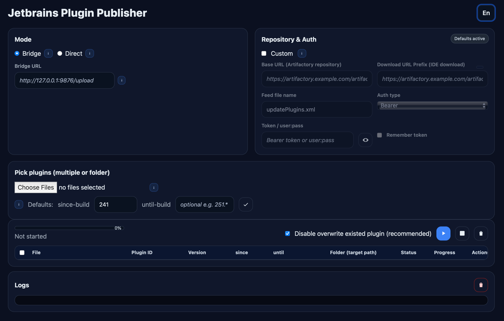

# Jetbrains Plugin Publisher

 [](./README.md) [](./README_CN.md) [](https://hub.docker.com/r/xooooooooox/jetbrains-plugin-publisher)

Publish IntelliJ‑platform plugins to a **custom plugin repository** (Artifactory, MinIO/S3, etc.) with a simple web UI
_or_ a one‑liner Gradle task.  
No manual editing of `updatePlugins.xml` required — it is generated/updated for you.

> Custom plugin repositories are an official IntelliJ mechanism. See JetBrains docs:  
> https://plugins.jetbrains.com/docs/intellij/custom-plugin-repository.html

Uploader engine: https://github.com/brian-mcnamara/plugin_uploader

---

## ✨ What you get

- **Two ways to publish**
    - **Web UI** (Bridge mode): drag‑and‑drop `.jar`/`.zip`, preview metadata, progress, logs.
    - **Headless/CLI**: run `gradle uploadPlugin -Pfile=...` inside the container.
- **Works with many backends** via HTTP PUT or S3 APIs: Artifactory, MinIO/S3, etc.
- **Auto‑maintained `updatePlugins.xml`** — the feed the IDE consumes.
- **Preflight overwrite protection** and readable diagnostics.
- **i18n UI** (English/中文).

---

## 📦 Prerequisites

- Docker or Docker Compose
- A custom plugin repository location you control (e.g., an Artifactory path or S3/MinIO bucket exposed via HTTP/S3 API)
- A token or basic credentials with write access to that location

---

## 🚀 Quick start (Docker)

Run the Bridge service locally and open the UI:

```shell
docker run --rm --name jetbrains-plugin-publisher \
  -p 9876:9876 \
  -e ARTIFACTORY_TOKEN=*********** \
  -e PUBLISHER_BASE_URL='https://artifactory.example.com/artifactory/jetbrains-plugin-local' \
  -e PUBLISHER_DOWNLOAD_PREFIX='https://artifactory.example.com/artifactory/jetbrains-plugin-local' \
  -e PUBLISHER_REPO='artifactory' \
  -e PUBLISHER_XML_NAME='updatePlugins.xml' \
  -v "$PWD:/work" \
  xooooooooox/jetbrains-plugin-publisher
```
**OR**

```shell
docker run --rm --name jetbrains-plugin-publisher \
  -p 9876:9876 \
  -v "$PWD/gradle.properties:/app/gradle.properties:ro" \
  -v "$PWD:/work" \
  xooooooooox/jetbrains-plugin-publisher
```

Open `http://127.0.0.1:9876/` in your browser.

### Quick start (Docker Compose)

```yaml
services:
  jpp:
    container_name: jetbrains-plugin-publisher
    image: xooooooooox/jetbrains-plugin-publisher
    ports: [ "9876:9876" ]
    environment:
      # Optional auth for uploads; provide one of the following:
      ARTIFACTORY_TOKEN: ${ARTIFACTORY_TOKEN:-}      # Bearer token
      PUBLISHER_BASIC: ${PUBLISHER_BASIC:-}          # user:pass (rare)
      # Repository targets
      PUBLISHER_BASE_URL: ${PUBLISHER_BASE_URL:-https://artifactory-oss.example.com/artifactory/jetbrains-plugin-local}
      PUBLISHER_DOWNLOAD_PREFIX: ${PUBLISHER_DOWNLOAD_PREFIX:-https://artifactory-oss.example.com/artifactory/jetbrains-plugin-local}
      PUBLISHER_REPO: ${PUBLISHER_REPO:-artifactory}
      PUBLISHER_XML_NAME: ${PUBLISHER_XML_NAME:-updatePlugins.xml}
    volumes:
      - $PWD/gradle.properties:/app/gradle.properties
      - $PWD:/work
    restart: unless-stopped
    healthcheck:
      test: [ "CMD-SHELL", "python3 - <<'PY'\nimport urllib.request,sys\nsys.exit(0) if urllib.request.urlopen('http://127.0.0.1:9876/status').getcode()==200 else sys.exit(1)\nPY" ]
      interval: 10s
      timeout: 5s
      retries: 5
      start_period: 10s
```

> **Why `PUBLISHER_DOWNLOAD_PREFIX`?**  
> This is the URL prefix your IDE will download from, typically the same path where binaries are uploaded.

### Templates: .env & gradle.properties

These templates help you configure uploads either via Docker Compose (using environment variables) or via Gradle
properties.

#### .env.template

> Loaded automatically by `docker compose` in this directory. If both `ARTIFACTORY_TOKEN` and `PUBLISHER_BASIC` are set,
> Bearer is typically used.

```env
# Host-side BuildKit (recommended)
DOCKER_BUILDKIT=1

PUBLISHER_BASE_URL='https://artifactory.example.com/artifactory/jetbrains-plugins-local'
PUBLISHER_DOWNLOAD_PREFIX='https://artifactory.example.com/artifactory/jetbrains-plugins-local'
PUBLISHER_REPO=artifactory
PUBLISHER_XML_NAME=updatePlugins.xml

# Authentication for uploads (choose one)
# - Bearer token (preferred):
ARTIFACTORY_TOKEN=********
# - Basic auth in the form user:password
PUBLISHER_BASIC=
```

#### gradle.properties.template

> Drop this next to your `build.gradle`/`settings.gradle` to configure the Gradle uploader plugin.

```properties
publisher.repo=artifactory
publisher.baseUrl=https://artifactory.example.com/artifactory/jetbrains-plugin-local
publisher.downloadUrlPrefix=https://artifactory.example.com/artifactory/jetbrains-plugin-local
publisher.xmlName=updatePlugins.xml
# Authentication (pick one)
# 1) used as Bearer token(Access Token)
# publisher.token=**************
# 2) Basic auth (rarely needed)
# publisher.basic=myuser:my_pass
```

---

## 🖥️ Use the Web UI (Bridge mode)



1. Open the page (`http://127.0.0.1:9876/`).
2. Leave **Mode = Bridge**. The Bridge service reads defaults from container env vars.
3. (Optional) Check **Custom** to override repository/auth at runtime.
4. Click **Choose Files** (supports selecting a folder). The page parses each plugin’s `plugin.xml` to prefill
   ID/version/builds.
5. Click **▶** to upload. The page shows per‑file progress and server logs.
6. On success, the container updates/creates `updatePlugins.xml` for the feed.

---

## 🧰 Use the CLI (inside the container)

You can upload without the UI, using the Gradle task backed by
the [plugin_uploader](https://github.com/brian-mcnamara/plugin_uploader) engine.

```shell
# Enter the running container (or run these in a dev shell):
docker exec -it jetbrains-plugin-publisher bash

# Upload a single plugin archive (.jar or .zip):
gradle -q uploadPlugin \
  -Pfile=/app/incoming/your-plugin-1.2.3.jar \
  -PpluginId=com.yourco.yourplugin \
  -PpluginVersion=1.2.3 \
  -PsinceBuild=241 \
  -PuntilBuild=251.* \
  -PpluginName=com.yourco.yourplugin \
  -PbaseUrl="$PUBLISHER_BASE_URL" \
  -PdownloadUrlPrefix="$PUBLISHER_DOWNLOAD_PREFIX" \
  -PxmlName="${PUBLISHER_XML_NAME:-updatePlugins.xml}"
```

Authentication is resolved as follows (highest priority first):

1. CLI flags `-Ptoken` (Bearer) / `-Pbasic` (user:pass)
2. Environment: `ARTIFACTORY_TOKEN` (or `PUBLISHER_TOKEN`) / `PUBLISHER_BASIC`
3. `gradle.properties`
4. `~/.config/jpp/jpp.properties`

---

## ⚙️ Configuration reference

| Purpose             | Gradle property                                     | Env var(s)                             | Notes                                            |
|---------------------|-----------------------------------------------------|----------------------------------------|--------------------------------------------------|
| Repository kind     | `repo` / `publisher.repo`                           | `PUBLISHER_REPO`                       | `artifactory` (REST PUT), `s3`, `minio`          |
| Base URL (upload)   | `baseUrl` / `publisher.baseUrl`                     | `PUBLISHER_BASE_URL`                   | Target root for binaries and `updatePlugins.xml` |
| Download URL prefix | `downloadUrlPrefix` / `publisher.downloadUrlPrefix` | `PUBLISHER_DOWNLOAD_PREFIX`            | What IDE sees in the feed                        |
| Feed file           | `xmlName` / `publisher.xmlName`                     | `PUBLISHER_XML_NAME`                   | Defaults to `updatePlugins.xml`                  |
| Token (Bearer)      | `token` / `publisher.token`                         | `ARTIFACTORY_TOKEN`, `PUBLISHER_TOKEN` | Preferred                                        |
| Basic auth          | `basic` / `publisher.basic`                         | `PUBLISHER_BASIC`                      | Format `user:pass` (rare)                        |
| S3/MinIO key        | `auth` / `publisher.minioAuth`                      | `MINIO_AUTH`, `AWS_ACCESS_KEY_ID`      | For S3/MinIO mode                                |

**Build range defaults**: `sinceBuild` defaults to `241` (can override), `untilBuild` optional.  
**Overwrite safety**: the Bridge server performs a HEAD/Range preflight; if a file exists and *Protect* is on, the
upload is skipped with `409` status.

---

## 🧩 How it fits with JetBrains custom repositories

IntelliJ/IDEA can install plugins from any HTTP location as long as there is a `updatePlugins.xml` feed that lists
plugins and versions.  
This project automates both steps:

1. Uploads your plugin archive to your storage (Artifactory/S3/etc.).
2. Ensures `updatePlugins.xml` contains/upserts an entry with:
    - `id`, `version`
    - `url` (built from **Download URL Prefix + path/to/file**)
    - `idea-version` (`since-build` / `until-build`)
    - Optional `name`, `description`, `change-notes` (parsed from plugin archive).

Point your IDE to the feed URL (Settings → Plugins → ⚙ → Manage Plugin Repositories).

Tips: [Format of updatePlugins.xml](https://plugins.jetbrains.com/docs/intellij/custom-plugin-repository.html#format-of-updatepluginsxml-file)

## 🔍 Troubleshooting

- **401/403**: token/basic credentials missing or wrong for the target path.
- **404**: base path does not exist in your repository.
- **`plugin.xml` error**: the archive doesn’t contain `META-INF/plugin.xml`.
- **Version unspecified**: pass `-PpluginVersion=` or fix `plugin.xml`’s `<version>`.
- **CORS errors (Direct mode)**: prefer Bridge mode unless your server allows PUT with `Authorization` from the browser.

Logs in the UI include timestamps; server returns masked commands for safety.

---

## 📚 Links

- JetBrains docs – Custom plugin repository: https://plugins.jetbrains.com/docs/intellij/custom-plugin-repository.html
- Gradle plugin uploader (engine): https://github.com/brian-mcnamara/plugin_uploader

---

## 📝 License

This project is licensed under the **MIT License**. See [LICENSE](LICENSE).
