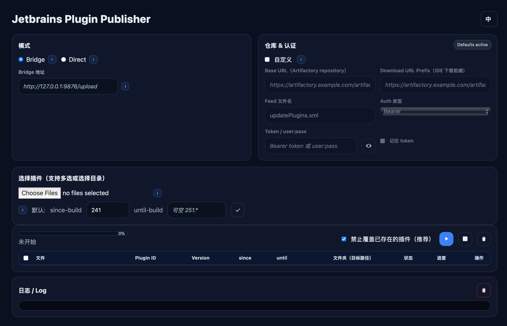

# JetBrains 插件发布器（JetBrains Plugin Publisher）

 [](./README.md) [](./README_CN.md) [](https://hub.docker.com/r/xooooooooox/jetbrains-plugin-publisher)

通过简单的网页界面或一行 Gradle 任务，将 IntelliJ 平台插件发布到**自定义插件仓库**（Artifactory、MinIO/S3 等）。
无需手动编辑 `updatePlugins.xml` —— 系统会自动生成/更新。

> 自定义插件仓库是 IntelliJ 的官方机制。参见 JetBrains 文档：  
> https://plugins.jetbrains.com/docs/intellij/custom-plugin-repository.html

上传引擎：https://github.com/brian-mcnamara/plugin_uploader

---

## ✨ 功能特性

- **两种发布方式**
    - **网页界面**（Bridge 模式）：拖拽 `.jar`/`.zip`、预览元数据、进度显示、日志输出
    - **无头/CLI**：在容器内运行 `gradle uploadPlugin -Pfile=...`
- **支持多种后端**：通过 HTTP PUT 或 S3 API 支持 Artifactory、MinIO/S3 等
- **自动维护 `updatePlugins.xml`** —— IDE 使用的订阅源
- **预检覆盖保护**和可读诊断信息
- **国际化界面**（中文/英文）

---

## 📦 先决条件

- Docker 或 Docker Compose
- 提前准备自定义插件仓库位置（如 Artifactory 路径或通过 HTTP/S3 API 暴露的 S3/MinIO 存储桶）
- 具有该位置写入权限的令牌或基本凭据

---

## 🚀 快速开始（Docker）

在本地运行 Bridge 服务并打开界面：

```shell
docker run --rm --name jetbrains-plugin-publisher \
  -p 9876:9876 \
  -e ARTIFACTORY_TOKEN=*********** \
  -e PUBLISHER_BASE_URL='https://artifactory.example.com/artifactory/jetbrains-plugin-local' \
  -e PUBLISHER_DOWNLOAD_PREFIX='https://artifactory.example.com/artifactory/jetbrains-plugin-local' \
  -e PUBLISHER_REPO='artifactory' \
  -e PUBLISHER_XML_NAME='updatePlugins.xml' \
  -v "$PWD:/work" \
  xooooooooox/jetbrains-plugin-publisher
```
**或者**

```shell
docker run --rm --name jetbrains-plugin-publisher \
  -p 9876:9876 \
  -v "$PWD/gradle.properties:/app/gradle.properties:ro" \
  -v "$PWD:/work" \
  xooooooooox/jetbrains-plugin-publisher
```

在浏览器中打开 `http://127.0.0.1:9876/`, 便可以开始上传插件了

### 快速开始（Docker Compose）

```yaml
services:
  jpp:
    container_name: jetbrains-plugin-publisher
    image: xooooooooox/jetbrains-plugin-publisher
    ports: [ "9876:9876" ]
    environment:
      # 上传的可选认证；提供以下其中一种：
      ARTIFACTORY_TOKEN: ${ARTIFACTORY_TOKEN:-}      # Bearer token
      PUBLISHER_BASIC: ${PUBLISHER_BASIC:-}          # user:pass (rare)
      # Repository targets
      PUBLISHER_BASE_URL: ${PUBLISHER_BASE_URL:-https://artifactory-oss.example.com/artifactory/jetbrains-plugin-local}
      PUBLISHER_DOWNLOAD_PREFIX: ${PUBLISHER_DOWNLOAD_PREFIX:-https://artifactory-oss.example.com/artifactory/jetbrains-plugin-local}
      PUBLISHER_REPO: ${PUBLISHER_REPO:-artifactory}
      PUBLISHER_XML_NAME: ${PUBLISHER_XML_NAME:-updatePlugins.xml}
    volumes:
      - $PWD:/work
    restart: unless-stopped
```

**或者**

```yaml
services:
  jpp:
    container_name: jetbrains-plugin-publisher
    image: xooooooooox/jetbrains-plugin-publisher
    ports: [ "9876:9876" ]
    volumes:
      - $PWD/gradle.properties:/app/gradle.properties
      - $PWD:/work
    restart: unless-stopped
```

> **为什么需要 `PUBLISHER_DOWNLOAD_PREFIX`？**  
> 这是您的 IDE 将从中下载的 URL 前缀，通常与上传二进制文件的路径相同。

### 模板：.env 与 gradle.properties

这些模板帮助您通过 Docker Compose（使用环境变量）或 Gradle 属性配置上传。

#### .env.template

> 会被此目录中的 `docker compose` 自动加载。如果同时设置了 `ARTIFACTORY_TOKEN` 和 `PUBLISHER_BASIC`，通常会使用 Bearer。

```env
DOCKER_BUILDKIT=1

PUBLISHER_BASE_URL='https://artifactory.example.com/artifactory/jetbrains-plugins-local'
PUBLISHER_DOWNLOAD_PREFIX='https://artifactory.example.com/artifactory/jetbrains-plugins-local'
PUBLISHER_REPO=artifactory
PUBLISHER_XML_NAME=updatePlugins.xml

# 上传认证（选择其一）
# - Bearer 令牌（首选）：
ARTIFACTORY_TOKEN=********
# - 基本认证，格式为 user:password
PUBLISHER_BASIC=
```

#### gradle.properties.template

> 将此文件放在您的 `build.gradle`/`settings.gradle` 旁边以配置 Gradle 上传插件。

```properties
publisher.repo=artifactory
publisher.baseUrl=https://artifactory.example.com/artifactory/jetbrains-plugin-local
publisher.downloadUrlPrefix=https://artifactory.example.com/artifactory/jetbrains-plugin-local
publisher.xmlName=updatePlugins.xml
# 认证（选择其一）
# 1) 用作 Bearer 令牌（访问令牌）
# publisher.token=**************
# 2) 基本认证（很少需要）
# publisher.basic=myuser:my_pass
```

---

## 🖥️ 使用网页界面（Bridge 模式）



1. 打开页面（`http://127.0.0.1:9876/`）
2. 保持**模式 = Bridge**。Bridge 服务从容器环境变量读取默认值
3. （可选）勾选**Custom**以在运行时覆盖仓库/认证设置
4. 点击**Choose Files**（支持选择文件夹）。页面会解析每个插件的 `plugin.xml` 来预填 ID/版本/构建信息
5. 点击**▶**开始上传。页面显示每个文件的进度和服务器日志
6. 成功后，容器会更新/创建用于订阅源的 `updatePlugins.xml`

---

## 🧰 使用 CLI（容器内）

您可以不使用界面，使用基于 [plugin_uploader](https://github.com/brian-mcnamara/plugin_uploader) 引擎的 Gradle 任务来上传。

```shell
# 进入运行中的容器（或在开发环境中运行）：
docker exec -it jetbrains-plugin-publisher bash

# 上传单个插件存档（.jar 或 .zip）：
gradle -q uploadPlugin \
  -Pfile=/app/incoming/your-plugin-1.2.3.jar \
  -PpluginId=com.yourco.yourplugin \
  -PpluginVersion=1.2.3 \
  -PsinceBuild=241 \
  -PuntilBuild=251.* \
  -PpluginName=com.yourco.yourplugin \
  -PbaseUrl="$PUBLISHER_BASE_URL" \
  -PdownloadUrlPrefix="$PUBLISHER_DOWNLOAD_PREFIX" \
  -PxmlName="${PUBLISHER_XML_NAME:-updatePlugins.xml}"
```

认证按以下顺序解析（优先级从高到低）：

1. CLI 标志 `-Ptoken`（Bearer）/ `-Pbasic`（user:pass）
2. 环境变量：`ARTIFACTORY_TOKEN`（或 `PUBLISHER_TOKEN`）/ `PUBLISHER_BASIC`
3. `gradle.properties`
4. `~/.config/jpp/jpp.properties`

---

## ⚙️ 配置参考

| 用途          | Gradle 属性                                           | 环境变量                                  | 说明                                   |
|-------------|-----------------------------------------------------|---------------------------------------|--------------------------------------|
| 仓库类型        | `repo` / `publisher.repo`                           | `PUBLISHER_REPO`                      | `artifactory`（REST PUT）、`s3`、`minio` |
| 基础 URL（上传）  | `baseUrl` / `publisher.baseUrl`                     | `PUBLISHER_BASE_URL`                  | 二进制文件和 `updatePlugins.xml` 的目标根路径    |
| 下载 URL 前缀   | `downloadUrlPrefix` / `publisher.downloadUrlPrefix` | `PUBLISHER_DOWNLOAD_PREFIX`           | IDE 在订阅源中看到的内容                       |
| 订阅文件        | `xmlName` / `publisher.xmlName`                     | `PUBLISHER_XML_NAME`                  | 默认为 `updatePlugins.xml`              |
| 令牌（Bearer）  | `token` / `publisher.token`                         | `ARTIFACTORY_TOKEN`、`PUBLISHER_TOKEN` | 首选                                   |
| 基本认证        | `basic` / `publisher.basic`                         | `PUBLISHER_BASIC`                     | 格式 `user:pass`（少见）                   |
| S3/MinIO 密钥 | `auth` / `publisher.minioAuth`                      | `MINIO_AUTH`、`AWS_ACCESS_KEY_ID`      | 用于 S3/MinIO 模式                       |

**构建范围默认值**：`sinceBuild` 默认为 `241`（可覆盖），`untilBuild` 可选。  
**覆盖安全**：Bridge 服务器执行 HEAD/Range 预检；如果文件存在且*保护*开启，上传会被跳过并返回 `409` 状态。

---

## 🧩 与 JetBrains 自定义仓库的集成

IntelliJ/IDEA 可以从任何 HTTP 位置安装插件，只要有一个列出插件和版本的 `updatePlugins.xml` 订阅源。  
本项目自动化了两个步骤：

1. 将您的插件存档上传到您的存储（Artifactory/S3 等）
2. 确保 `updatePlugins.xml` 包含/更新一个条目，包括：
    - `id`、`version`
    - `url`（从**下载 URL 前缀 + path/to/file**构建）
    - `idea-version`（`since-build` / `until-build`）
    - 可选的 `name`、`description`、`change-notes`（从插件存档解析）

将您的 IDE 指向订阅 URL（设置 → 插件 → ⚙ → 管理插件仓库）。

提示：[updatePlugins.xml 格式](https://plugins.jetbrains.com/docs/intellij/custom-plugin-repository.html#format-of-updatepluginsxml-file)

## 🔍 故障排除

- **401/403**：目标路径的令牌/基本凭据缺失或错误
- **404**：您的仓库中不存在基础路径
- **`plugin.xml` 错误**：存档不包含 `META-INF/plugin.xml`
- **版本未指定**：传递 `-PpluginVersion=` 或修复 `plugin.xml` 的 `<version>`
- **CORS 错误（直接模式）**：除非您的服务器允许浏览器使用 `Authorization` 进行 PUT，否则优先使用 Bridge 模式

界面中的日志包含时间戳；为安全起见，服务器返回掩码命令。

---

## 📚 链接

- JetBrains 文档 —— 自定义插件仓库：https://plugins.jetbrains.com/docs/intellij/custom-plugin-repository.html
- Gradle 插件上传器（引擎）：https://github.com/brian-mcnamara/plugin_uploader

---

## 📄 许可证

本项目采用 **MIT 许可证**。参见 [LICENSE](LICENSE)。